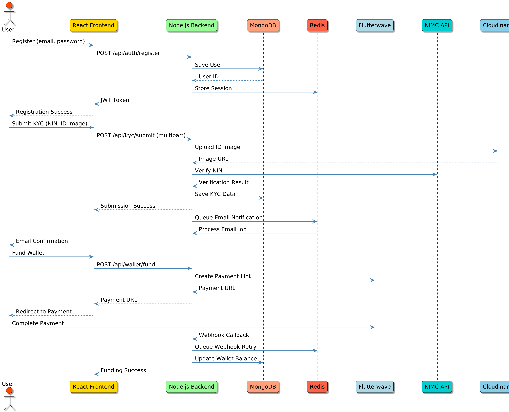
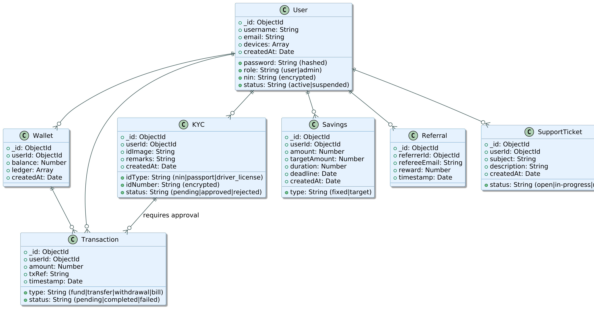
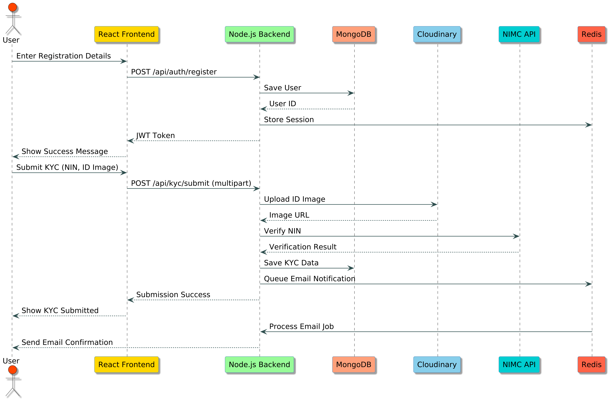

# NEG AI Banking

NEG AI Banking is a scalable digital banking platform designed to provide a smooth banking experience in Nigeria, offering wallet management, secure transactions, advanced KYC verification, and robust admin controls. It aims to compete with platforms like Opay and Palmpay by leveraging modern technologies and compliance with Nigerian regulations.

## Table of Contents
1. [Project Overview](#project-overview)
2. [Features](#features)
3. [Project Structure](#project-structure)
4. [Installation and Setup](#installation-and-setup)
5. [API Documentation](#api-documentation)
6. [Frontend Components](#frontend-components)
7. [Backend Architecture](#backend-architecture)
8. [Testing](#testing)


## Project Overview

NEG AI Banking is a full-stack web application built to streamline digital banking operations. It supports user authentication, wallet operations, KYC verification, bill payments, savings plans, and admin oversight. The platform is designed with scalability, security, and compliance in mind, adhering to Nigeria’s CBN (KYC/AML) and NDPC (data protection) regulations.

### Tech Stack
- **Backend**: Node.js, Express.js, MongoDB (Mongoose), Redis/BullMQ, JavaScript (ESM)
- **Frontend**: Next.js, React, TailwindCSS, Redux Toolkit, React Query, JavaScript (ESM)
- **Payments**: Flutterwave for wallet funding, transfers, and bill payments
- **KYC Verification**: NIMC API (NIN), YouVerify/Smile Identity (passport), Cloudinary (image uploads)
- **Authentication**: jsonwebtoken, bcrypt, mongoose-encryption
- **Security**: helmet, express-rate-limit, express-mongo-sanitize, xss-clean
- **Email**: Nodemailer with Handlebars
- **Cron Jobs**: node-cron, BullMQ for job queues
- **Testing**: Jest, Supertest (backend); Playwright (frontend)
- **Logging**: Winston, Logtail
- **Monitoring**: Sentry (error tracking), LogRocket (frontend UX)
- **Deployment**: Docker, Render (backend), Vercel (frontend), GitHub Actions (CI/CD)
- **Real-time**: Socket.io for notifications

## Features

### User Features
1. **Authentication**:
   - JWT-based signup, login, password reset, refresh tokens, and multi-device session management.
   - Email notifications for registration and password reset.
2. **Wallet Management**:
   - Fund wallet via Flutterwave (card, bank transfer).
   - Transfer funds (P2P, bank accounts).
   - View balance and ledger-based transaction history with filtering and pagination.
3. **KYC Verification**:
   - Upload government-issued IDs (NIN, driver’s license, international passport) via Cloudinary.
   - Real-time NIN verification via NIMC API.
   - Passport verification and face matching via YouVerify/Smile Identity.
   - Check KYC status (pending, approved, rejected).
4. **Bill Payments**:
   - Pay bills (e.g., electricity, internet) via Flutterwave.
5. **Savings Plans**:
   - Create fixed or target-based savings plans.
   - Track savings progress and deadlines.
6. **Notifications**:
   - Real-time notifications via Socket.io for transactions and KYC updates.
   - Email notifications for critical actions.
7. **Referral System**:
   - Invite friends to earn wallet credits.
8. **Support Tickets**:
   - Submit and track support requests with email notifications.

### Admin Features
1. **User Management**:
   - View, suspend, reactivate, or delete user accounts.
2. **KYC Approval**:
   - Approve/reject KYC submissions with remarks.
   - View NIMC/YouVerify verification results.
3. **Transaction Monitoring**:
   - View all transactions with filtering (type, status, date) and pagination.
4. **Dashboard Analytics**:
   - Total users, verified KYC count, wallet balances, and transaction volume.
   - Transactions per day/week/month.
   - Fraud detection metrics (e.g., flagged accounts).
5. **System Announcements**:
   - Create, edit, and broadcast platform-wide announcements.
6. **Fraud Detection**:
   - Flag suspicious activities (e.g., multiple failed logins, high-frequency transactions).
  

## System Diagrams

Below are the key diagrams illustrating the architecture and design of TaskSync Pro.

### Data Flow Diagram



### UML Class Diagram



### UML Sequence Diagram



## Project Structure

```plaintext
.
├── .gitignore
├── .env.example
├── package.json
├── Dockerfile
├── docker-compose.yml
├── .eslintrc.json
├── .prettierrc
├── backend
│   ├── src
│   │   ├── config
│   │   │   ├── db.js
│   │   │   └── env.js
│   │   ├── controllers
│   │   │   ├── authController.js
│   │   │   ├── billController.js
│   │   │   ├── kycController.js
│   │   │   ├── savingsController.js
│   │   │   ├── transactionController.js
│   │   │   ├── adminController.js
│   │   │   ├── referralController.js
│   │   │   └── supportController.js
│   │   ├── middlewares
│   │   │   ├── authMiddleware.js
│   │   │   ├── roleMiddleware.js
│   │   │   ├── securityMiddleware.js
│   │   │   ├── corsMiddleware.js
│   │   │   ├── errorHandler.js
│   │   │   └── notFound.js
│   │   ├── models
│   │   │   ├── User.js
│   │   │   ├── Wallet.js
│   │   │   ├── Transaction.js
│   │   │   ├── KYC.js
│   │   │   ├── Bill.js
│   │   │   ├── Savings.js
│   │   │   ├── Referral.js
│   │   │   └── SupportTicket.js
│   │   ├── routes
│   │   │   ├── authRoutes.js
│   │   │   ├── walletRoutes.js
│   │   │   ├── kycRoutes.js
│   │   │   ├── billRoutes.js
│   │   │   ├── savingsRoutes.js
│   │   │   ├── transactionRoutes.js
│   │   │   ├── adminRoutes.js
│   │   │   ├── referralRoutes.js
│   │   │   └── supportRoutes.js
│   │   ├── services
│   │   │   ├── flutterwaveService.js
│   │   │   ├── kycService.js
│   │   │   ├── emailService.js
│   │   │   ├── notificationService.js
│   │   │   └── walletService.js
│   │   ├── utils
│   │   │   ├── logger.js
│   │   │   └── emailTemplates.js
│   │   ├── jobs
│   │   │   ├── transactionSummary.js
│   │   │   └── walletAudit.js
│   │   ├── tests
│   │   │   ├── auth.test.js
│   │   │   ├── wallet.test.js
│   │   │   ├── kyc.test.js
│   │   │   ├── transaction.test.js
│   │   │   └── admin.test.js
│   │   ├── app.js
│   │   └── server.js
├── frontend
│   ├── pages
│   │   ├── index.js
│   │   ├── login.js
│   │   ├── signup.js
│   │   ├── dashboard.js
│   │   ├── wallet.js
│   │   ├── transactions.js
│   │   ├── profile.js
│   │   ├── kyc.js
│   │   ├── support.js
│   │   ├── admin
│   │   │   ├── index.js
│   │   │   ├── users.js
│   │   │   ├── transactions.js
│   │   │   ├── kyc.js
│   │   │   ├── announcements.js
│   ├── components
│   │   ├── common
│   │   │   ├── Button.jsx
│   │   │   ├── Card.jsx
│   │   │   ├── Dropdown.jsx
│   │   │   ├── Input.jsx
│   │   │   ├── Loader.jsx
│   │   │   ├── Modal.jsx
│   │   │   ├── ProgressBar.jsx
│   │   │   ├── Table.jsx
│   │   │   ├── Toast.jsx
│   │   │   ├── Alert.jsx
│   │   │   └── Toggle.jsx
│   │   ├── forms
│   │   │   ├── BillPaymentForm.jsx
│   │   │   ├── CardLimitForm.jsx
│   │   │   ├── CardRequestForm.jsx
│   │   │   ├── FixedSavingsForm.jsx
│   │   │   ├── FundWalletForm.jsx
│   │   │   ├── KYCForm.jsx
│   │   │   ├── LoginForm.jsx
│   │   │   ├── NotificationSettingsForm.jsx
│   │   │   ├── PasswordResetForm.jsx
│   │   │   ├── SignupForm.jsx
│   │   │   ├── TargetSavingsForm.jsx
│   │   │   ├── TransferForm.jsx
│   │   │   ├── VerifyBankForm.jsx
│   │   │   └── SupportTicketForm.jsx
│   │   ├── layout
│   │   │   ├── AuthLayout.jsx
│   │   │   ├── AdminLayout.jsx
│   │   │   ├── Footer.jsx
│   │   │   ├── Header.jsx
│   │   │   ├── Navbar.jsx
│   │   │   ├── ProtectedRoute.jsx
│   │   │   └── Sidebar.jsx
│   │   ├── ui
│   │   │   ├── AnalyticsChart.jsx
│   │   │   ├── CardDetails.jsx
│   │   │   ├── KYCStatus.jsx
│   │   │   ├── LanguageSelector.jsx
│   │   │   ├── NotificationBanner.jsx
│   │   │   ├── SavingsCard.jsx
│   │   │   └── TransactionCard.jsx
│   ├── services
│   │   ├── api.js
│   │   └── socket.js
│   ├── utils
│   │   ├── helpers.js
│   │   └── validators.js
│   ├── hooks
│   │   ├── useAuth.js
│   │   ├── useFetch.js
│   ├── contexts
│   │   ├── AuthContext.js
│   ├── store
│   │   ├── slices
│   │   │   ├── authSlice.js
│   │   │   ├── walletSlice.js
│   │   ├── store.js
│   ├── styles
│   │   ├── globals.css
│   ├── tests
│   │   ├── Button.test.jsx
│   │   ├── LoginForm.test.jsx
│   │   ├── TransactionCard.test.jsx
│   ├── package.json
│   ├── tailwind.config.js
│   ├── postcss.config.js
│   ├── .eslintrc.json
│   ├── .prettierrc
└── README.md
```

### Directory Descriptions
- **backend**: Node.js/Express backend with controllers, models, routes, middleware, services, and utilities for authentication, wallet, KYC, bills, savings, and admin functions.
- **frontend**: React frontend with pages, components, services, and state management for user and admin interfaces.
- **tests**: Jest (backend) and Playwright (frontend) test suites.
- **config**: Backend configuration for MongoDB and environment variables.
- **services**: Integrations for Flutterwave, KYC APIs, and email notifications.
- **utils**: Logging and email template utilities.
- **jobs**: Cron jobs and background tasks using node-cron and BullMQ.

## Installation and Setup

### Prerequisites
- Node.js (v18 or higher)
- MongoDB (v5.0 or higher)
- Redis (v6.2 or higher)
- npm (v8 or higher)
- Flutterwave account for payments
- NIMC/YouVerify/Smile Identity API keys for KYC
- Cloudinary account for image uploads
- Email service provider (e.g., SendGrid) for notifications

### Backend Setup
1. Navigate to the backend directory:
   ```bash
   cd backend
   ```
2. Install dependencies:
   ```bash
   npm install
   ```
3. Copy `.env.example` to `.env` and configure environment variables:
   ```bash
   cp .env.example .env
   ```
4. Example `.env`:
   ```bash
   PORT=3000
   MONGODB_URI=your_mongo_uri
   REDIS_URL=redis://localhost:6379
   JWT_SECRET=your_jwt_secret
   EMAIL_SERVICE=gmail
   EMAIL_USER=your_email@gmail.com
   EMAIL_PASS=your_email_password
   FLUTTERWAVE_SECRET_KEY=your_flutterwave_secret
   FLUTTERWAVE_PUBLIC_KEY=your_flutterwave_public
   CLOUDINARY_API_KEY=your_cloudinary_key
   CLOUDINARY_SECRET=your_cloudinary_secret
   NIMC_API_KEY=your_nimc_api_key
   YOUVERIFY_API_KEY=your_youverify_api_key
   SMILE_IDENTITY_API_KEY=your_smile_identity_api_key
   NODE_ENV=development
   BASE_URL=http://localhost:3000
   FRONTEND_URL=http://localhost:3001
   ENCRYPTION_KEY=your_encryption_key_32_bytes
   ENCRYPTION_IV=your_encryption_iv_16_bytes
   ```
5. Start the backend server:
   ```bash
   npm run dev
   ```

### Frontend Setup
1. Navigate to the frontend directory:
   ```bash
   cd frontend
   ```
2. Install dependencies:
   ```bash
   npm install
   ```
3. Copy `.env.example` to `.env` and configure environment variables:
   ```bash
   cp .env.example .env
   ```
4. Example `.env`:
   ```bash
   VITE_API_URL=http://localhost:3000/api
   VITE_SOCKET_URL=http://localhost:3000
   ```
5. Start the frontend development server:
   ```bash
   npm run dev
   ```

### Database Setup
1. Ensure MongoDB and Redis are running locally or on hosted services.
2. Update `MONGODB_URI` and `REDIS_URL` in the backend `.env` file.

### Testing
1. Backend tests:
   ```bash
   cd backend
   npm test
   ```
2. Frontend tests:
   ```bash
   cd frontend
   npx playwright test
   ```

## API Documentation

The NEG AI Banking API provides endpoints for authentication, wallet management, KYC verification, bill payments, savings plans, referrals, and support tickets. All endpoints are prefixed with `/api` and require JWT authentication unless specified otherwise.

### Authentication
- **Header**: `Authorization: Bearer <token>`
- **Token Generation**: Obtain a token via `/auth/login` or `/auth/refresh`.

#### Authentication Endpoints
**POST /api/auth/register**
- **Description**: Register a new user.
- **Request Body**:
  ```json
  {
    "username": "string",
    "email": "string",
    "password": "string",
    "role": "string" // optional, defaults to "user"
  }
  ```
- **Response**:
  ```json
  {
    "message": "User registered successfully",
    "user": {
      "id": "user_id",
      "username": "string",
      "email": "string",
      "role": "string"
    },
    "token": "jwt_token"
  }
  ```
- **Errors**:
  - 400: Invalid input
  - 409: Email already exists

**POST /api/auth/login**
- **Description**: Authenticate a user and return a JWT token.
- **Request Body**:
  ```json
  {
    "email": "string",
    "password": "string"
  }
  ```
- **Response**:
  ```json
  {
    "token": "jwt_token",
    "refreshToken": "refresh_token",
    "user": {
      "id": "user_id",
      "username": "string",
      "email": "string",
      "role": "string"
    }
  }
  ```
- **Errors**:
  - 401: Invalid credentials
  - 400: Missing fields

**POST /api/auth/refresh**
- **Description**: Refresh a JWT token using a refresh token.
- **Request Body**:
  ```json
  {
    "refreshToken": "string"
  }
  ```
- **Response**:
  ```json
  {
    "token": "new_jwt_token"
  }
  ```
- **Errors**:
  - 401: Invalid or expired refresh token

**POST /api/auth/password-reset**
- **Description**: Initiate a password reset.
- **Request Body**:
  ```json
  {
    "email": "string"
  }
  ```
- **Response**:
  ```json
  {
    "message": "Password reset email sent"
  }
  ```
- **Errors**:
  - 404: User not found
  - 400: Missing email

**GET /api/auth/me**
- **Description**: Get authenticated user’s profile.
- **Headers**: `Authorization: Bearer <token>`
- **Response**:
  ```json
  {
    "id": "user_id",
    "username": "string",
    "email": "string",
    "role": "string"
  }
  ```
- **Errors**:
  - 401: Unauthorized

**POST /api/auth/logout-all**
- **Description**: Log out from all devices.
- **Headers**: `Authorization: Bearer <token>`
- **Response**:
  ```json
  {
    "message": "Logged out from all devices"
  }
  ```
- **Errors**:
  - 401: Unauthorized

#### Wallet Endpoints
**GET /api/wallet/balance**
- **Description**: Get the user’s wallet balance.
- **Headers**: `Authorization: Bearer <token>`
- **Response**:
  ```json
  {
    "balance": number
  }
  ```
- **Errors**:
  - 401: Unauthorized

**POST /api/wallet/fund**
- **Description**: Fund the user’s wallet via Flutterwave.
- **Headers**: `Authorization: Bearer <token>`
- **Request Body**:
  ```json
  {
    "amount": number
  }
  ```
- **Response**:
  ```json
  {
    "message": "Wallet funded successfully",
    "balance": number,
    "paymentLink": "string"
  }
  ```
- **Errors**:
  - 400: Invalid amount
  - 401: Unauthorized

**POST /api/wallet/transfer**
- **Description**: Transfer funds to another user or bank account.
- **Headers**: `Authorization: Bearer <token>`
- **Request Body**:
  ```json
  {
    "recipientEmail": "string",
    "bankDetails": {
      "accountNumber": "string",
      "bankName": "string"
    },
    "amount": number
  }
  ```
- **Response**:
  ```json
  {
    "message": "Transfer successful",
    "balance": number
  }
  ```
- **Errors**:
  - 400: Insufficient funds or invalid input
  - 404: Recipient not found
  - 401: Unauthorized

**POST /api/wallet/withdraw**
- **Description**: Withdraw funds to a bank account.
- **Headers**: `Authorization: Bearer <token>`
- **Request Body**:
  ```json
  {
    "amount": number,
    "bankDetails": {
      "accountNumber": "string",
      "bankName": "string"
    }
  }
  ```
- **Response**:
  ```json
  {
    "message": "Withdrawal successful",
    "balance": number
  }
  ```
- **Errors**:
  - 400: Invalid amount or bank details
  - 401: Unauthorized

**GET /api/wallet/transactions**
- **Description**: Get transaction history with filtering and pagination.
- **Headers**: `Authorization: Bearer <token>`
- **Query Parameters**: `limit`, `page`, `type`, `status`, `startDate`, `endDate`
- **Response**:
  ```json
  {
    "transactions": [
      {
        "id": "transaction_id",
        "type": "fund|transfer|withdrawal|bill",
        "amount": number,
        "status": "pending|completed|failed",
        "timestamp": "2025-07-14T10:20:00Z"
      }
    ],
    "total": number
  }
  ```
- **Errors**:
  - 401: Unauthorized

#### KYC Endpoints
**POST /api/kyc/submit**
- **Description**: Submit KYC documents for verification.
- **Headers**: `Authorization: Bearer <token>`
- **Request Body**: Form-data with fields (e.g., `idCard`, `proofOfAddress`, `idType`, `idNumber`)
- **Response**:
  ```json
  {
    "message": "KYC submitted successfully"
  }
  ```
- **Errors**:
  - 400: Invalid files or input
  - 401: Unauthorized

**GET /api/kyc/status**
- **Description**: Check KYC verification status.
- **Headers**: `Authorization: Bearer <token>`
- **Response**:
  ```json
  {
    "status": "pending|approved|rejected",
    "remarks": "string"
  }
  ```
- **Errors**:
  - 401: Unauthorized

#### Bill Payment Endpoints
**POST /api/bills/pay**
- **Description**: Pay a bill via Flutterwave.
- **Headers**: `Authorization: Bearer <token>`
- **Request Body**:
  ```json
  {
    "billType": "string",
    "amount": number,
    "provider": "string"
  }
  ```
- **Response**:
  ```json
  {
    "message": "Bill payment successful",
    "balance": number
  }
  ```
- **Errors**:
  - 400: Invalid bill details
  - 401: Unauthorized

#### Savings Endpoints
**POST /api/savings/fixed**
- **Description**: Create a fixed savings plan.
- **Headers**: `Authorization: Bearer <token>`
- **Request Body**:
  ```json
  {
    "amount": number,
    "duration": number
  }
  ```
- **Response**:
  ```json
  {
    "message": "Fixed savings created",
    "savings": {
      "id": "savings_id",
      "amount": number,
      "duration": number,
      "createdAt": "2025-07-14T10:20:00Z"
    }
  }
  ```
- **Errors**:
  - 400: Invalid amount or duration
  - 401: Unauthorized

**POST /api/savings/target**
- **Description**: Create a target savings plan.
- **Headers**: `Authorization: Bearer <token>`
- **Request Body**:
  ```json
  {
    "targetAmount": number,
    "deadline": "string"
  }
  ```
- **Response**:
  ```json
  {
    "message": "Target savings created",
    "savings": {
      "id": "savings_id",
      "targetAmount": number,
      "deadline": "2025-12-31T23:59:59Z",
      "createdAt": "2025-07-14T10:20:00Z"
    }
  }
  ```
- **Errors**:
  - 400: Invalid target or deadline
  - 401: Unauthorized

#### Referral Endpoints
**POST /api/referrals/invite**
- **Description**: Generate a referral link for inviting friends.
- **Headers**: `Authorization: Bearer <token>`
- **Response**:
  ```json
  {
    "message": "Referral link generated",
    "referralLink": "string"
  }
  ```
- **Errors**:
  - 401: Unauthorized

**GET /api/referrals**
- **Description**: Get user’s referral history.
- **Headers**: `Authorization: Bearer <token>`
- **Response**:
  ```json
  {
    "referrals": [
      {
        "id": "referral_id",
        "refereeEmail": "string",
        "reward": number,
        "timestamp": "2025-07-14T10:20:00Z"
      }
    ]
  }
  ```
- **Errors**:
  - 401: Unauthorized

#### Support Endpoints
**POST /api/support/ticket**
- **Description**: Submit a support ticket.
- **Headers**: `Authorization: Bearer <token>`
- **Request Body**:
  ```json
  {
    "subject": "string",
    "description": "string"
  }
  ```
- **Response**:
  ```json
  {
    "message": "Support ticket created",
    "ticket": {
      "id": "ticket_id",
      "subject": "string",
      "status": "open|in-progress|resolved",
      "createdAt": "2025-07-14T10:20:00Z"
    }
  }
  ```
- **Errors**:
  - 400: Invalid input
  - 401: Unauthorized

**GET /api/support/tickets**
- **Description**: Get user’s support tickets.
- **Headers**: `Authorization: Bearer <token>`
- **Response**:
  ```json
  {
    "tickets": [
      {
        "id": "ticket_id",
        "subject": "string",
        "status": "open|in-progress|resolved",
        "createdAt": "2025-07-14T10:20:00Z"
      }
    ]
  }
  ```
- **Errors**:
  - 401: Unauthorized

#### Admin Endpoints
**GET /api/admin/users**
- **Description**: Retrieve all users (admin only).
- **Headers**: `Authorization: Bearer <token>`
- **Response**:
  ```json
  {
    "users": [
      {
        "id": "user_id",
        "username": "string",
        "email": "string",
        "role": "user|admin",
        "kycStatus": "pending|approved|rejected"
      }
    ]
  }
  ```
- **Errors**:
  - 403: Forbidden (non-admin)
  - 401: Unauthorized

**PUT /api/admin/users/:id**
- **Description**: Update user details (admin only).
- **Headers**: `Authorization: Bearer <token>`
- **Request Body**:
  ```json
  {
    "role": "user|admin",
    "status": "active|suspended"
  }
  ```
- **Response**:
  ```json
  {
    "message": "User updated",
    "user": {
      "id": "user_id",
      "username": "string",
      "role": "user|admin",
      "status": "active|suspended"
    }
  }
  ```
- **Errors**:
  - 404: User not found
  - 403: Forbidden
  - 401: Unauthorized

**GET /api/admin/transactions**
- **Description**: Retrieve all transactions with filtering (admin only).
- **Headers**: `Authorization: Bearer <token>`
- **Query Parameters**: `limit`, `page`, `type`, `status`, `startDate`, `endDate`
- **Response**:
  ```json
  {
    "transactions": [
      {
        "id": "transaction_id",
        "userId": "user_id",
        "type": "fund|transfer|withdrawal|bill",
        "amount": number,
        "status": "pending|completed|failed",
        "timestamp": "2025-07-14T10:20:00Z"
      }
    ],
    "total": number
  }
  ```
- **Errors**:
  - 403: Forbidden
  - 401: Unauthorized

**GET /api/admin/kyc/pending**
- **Description**: Retrieve pending KYC submissions (admin only).
- **Headers**: `Authorization: Bearer <token>`
- **Response**:
  ```json
  {
    "kycSubmissions": [
      {
        "id": "kyc_id",
        "userId": "user_id",
        "idType": "nin|passport|driver_license",
        "idNumber": "string",
        "status": "pending"
      }
    ]
  }
  ```
- **Errors**:
  - 403: Forbidden
  - 401: Unauthorized

**POST /api/admin/kyc/approve/:id**
- **Description**: Approve a KYC submission (admin only).
- **Headers**: `Authorization: Bearer <token>`
- **Request Body**:
  ```json
  {
    "remarks": "string"
  }
  ```
- **Response**:
  ```json
  {
    "message": "KYC approved"
  }
  ```
- **Errors**:
  - 404: KYC submission not found
  - 403: Forbidden
  - 401: Unauthorized

**POST /api/admin/kyc/reject/:id**
- **Description**: Reject a KYC submission (admin only).
- **Headers**: `Authorization: Bearer <token>`
- **Request Body**:
  ```json
  {
    "remarks": "string"
  }
  ```
- **Response**:
  ```json
  {
    "message": "KYC rejected"
  }
  ```
- **Errors**:
  - 404: KYC submission not found
  - 403: Forbidden
  - 401: Unauthorized

**POST /api/admin/announcements**
- **Description**: Create a system announcement (admin only).
- **Headers**: `Authorization: Bearer <token>`
- **Request Body**:
  ```json
  {
    "title": "string",
    "content": "string"
  }
  ```
- **Response**:
  ```json
  {
    "message": "Announcement created",
    "announcement": {
      "id": "announcement_id",
      "title": "string",
      "content": "string",
      "createdAt": "2025-07-14T10:20:00Z"
    }
  }
  ```
- **Errors**:
  - 400: Invalid input
  - 403: Forbidden
  - 401: Unauthorized

**GET /api/admin/dashboard**
- **Description**: Retrieve dashboard analytics (admin only).
- **Headers**: `Authorization: Bearer <token>`
- **Response**:
  ```json
  {
    "totalUsers": number,
    "verifiedKycCount": number,
    "totalBalance": number,
    "transactionVolume": number,
    "transactionsByPeriod": {
      "daily": number,
      "weekly": number,
      "monthly": number
    },
    "flaggedAccounts": number
  }
  ```
- **Errors**:
  - 403: Forbidden
  - 401: Unauthorized

## Frontend Components

### Common Components
- **Button.jsx**: Reusable button with customizable styles.
- **Card.jsx**: Displays content in a card layout (e.g., wallet balance).
- **Dropdown.jsx**: Dropdown menu for selecting options.
- **Input.jsx**: Custom input field with validation.
- **Loader.jsx**: Loading spinner for async operations.
- **Modal.jsx**: Modal dialog for forms and confirmations.
- **ProgressBar.jsx**: Visual progress indicator for savings goals.
- **Table.jsx**: Responsive table for transaction history.
- **Toast.jsx**: Notification popups for success/error messages.
- **Alert.jsx**: Alert messages for warnings and errors.
- **Toggle.jsx**: Toggle switch for settings (e.g., notifications).

### Forms
- **BillPaymentForm.jsx**: Form for paying bills via Flutterwave.
- **CardLimitForm.jsx**: Set spending limits for cards.
- **CardRequestForm.jsx**: Request a new virtual/physical card.
- **FixedSavingsForm.jsx**: Create a fixed savings plan.
- **FundWalletForm.jsx**: Fund wallet with Flutterwave integration.
- **KYCForm.jsx**: Upload KYC documents (NIN, passport, driver’s license).
- **LoginForm.jsx**: User login form with refresh token support.
- **NotificationSettingsForm.jsx**: Configure notification preferences.
- **PasswordResetForm.jsx**: Reset user password via email.
- **SignupForm.jsx**: User registration form.
- **TargetSavingsForm.jsx**: Create a target savings plan.
- **TransferForm.jsx**: Transfer funds to another user or bank.
- **VerifyBankForm.jsx**: Verify bank account for withdrawals.
- **SupportTicketForm.jsx**: Submit support tickets.

### Layout Components
- **AuthLayout.jsx**: Layout for unauthenticated pages (login, signup).
- **AdminLayout.jsx**: Layout for admin dashboard pages.
- **Footer.jsx**: Page footer with links and branding.
- **Header.jsx**: Page header with navigation.
- **Navbar.jsx**: Top navigation bar.
- **ProtectedRoute.jsx**: Restricts access to authenticated users.
- **Sidebar.jsx**: Sidebar for navigation on dashboard pages.

### UI Components
- **AnalyticsChart.jsx**: Displays spending/savings charts using Chart.js.
- **CardDetails.jsx**: Shows card details (e.g., number, expiry).
- **KYCStatus.jsx**: Displays KYC verification status.
- **LanguageSelector.jsx**: Selects language for i18n.
- **NotificationBanner.jsx**: Shows system announcements.
- **SavingsCard.jsx**: Displays savings plan details.
- **TransactionCard.jsx**: Shows individual transaction details.

## Backend Architecture

### Models
- **User.js**: Stores user data (username, email, password, role, NIN, encrypted fields).
- **Wallet.js**: Manages wallet balance and ledger array.
- **Transaction.js**: Tracks transaction history (fund, transfer, withdrawal, bill).
- **KYC.js**: Stores KYC documents, verification status, and remarks.
- **Bill.js**: Handles bill payment details.
- **Savings.js**: Manages fixed and target savings plans.
- **Referral.js**: Tracks referral links and rewards.
- **SupportTicket.js**: Manages support tickets and statuses.

### Controllers
- **authController.js**: Handles registration, login, refresh tokens, password reset, and session management.
- **walletController.js**: Manages wallet funding, transfers, withdrawals, and balance checks.
- **kycController.js**: Processes KYC submissions, NIMC/YouVerify verification, and status checks.
- **billController.js**: Handles bill payments via Flutterwave.
- **savingsController.js**: Manages savings plan creation and updates.
- **transactionController.js**: Handles transaction history with filtering and pagination.
- **adminController.js**: Manages admin functions (users, KYC, transactions, analytics, announcements).
- **referralController.js**: Handles referral link generation and rewards.
- **supportController.js**: Manages support ticket CRUD operations.

### Routes
- **authRoutes.js**: Authentication endpoints (register, login, refresh, etc.).
- **walletRoutes.js**: Wallet operations (fund, transfer, withdraw, balance).
- **kycRoutes.js**: KYC submission and status checks.
- **billRoutes.js**: Bill payment endpoints.
- **savingsRoutes.js**: Savings plan endpoints.
- **transactionRoutes.js**: Transaction history endpoints.
- **adminRoutes.js**: Admin-only endpoints for user, KYC, and transaction management.
- **referralRoutes.js**: Referral system endpoints.
- **supportRoutes.js**: Support ticket endpoints.

### Middleware
- **authMiddleware.js**: JWT authentication for protected routes.
- **roleMiddleware.js**: Role-based access control (User, Admin).
- **securityMiddleware.js**: Security headers (helmet), rate-limiting, input sanitization.
- **corsMiddleware.js**: Enables CORS for frontend integration.
- **errorHandler.js**: Global error handling with JSON responses.
- **notFound.js**: Handles 404 errors.

### Services
- **flutterwaveService.js**: Integrates Flutterwave for payments and webhooks.
- **kycService.js**: Handles NIMC, YouVerify, and Cloudinary integrations.
- **emailService.js**: Sends emails using Nodemailer and Handlebars.
- **notificationService.js**: Manages real-time notifications via Socket.io.
- **walletService.js**: Handles wallet credit/debit logic.

### Utilities
- **logger.js**: Winston-based logging for file and console output.
- **emailTemplates.js**: Handlebars templates for email notifications.

### Jobs
- **transactionSummary.js**: Daily transaction summaries sent to admins.
- **walletAudit.js**: Detects negative balances and flags suspicious accounts.

## Testing

### Backend Testing
- Tests are located in `backend/src/tests`.
- Uses Jest and Supertest for unit and integration tests.
- Example test files: `auth.test.js`, `wallet.test.js`, `kyc.test.js`.
- Run tests:
  ```bash
  cd backend
  npm test
  ```

### Frontend Testing
- Tests are located in `frontend/tests`.
- Uses Playwright for end-to-end testing.
- Example test files: `Button.test.jsx`, `LoginForm.test.jsx`.
- Run tests:
  ```bash
  cd frontend
  npx playwright test
  ```
```
